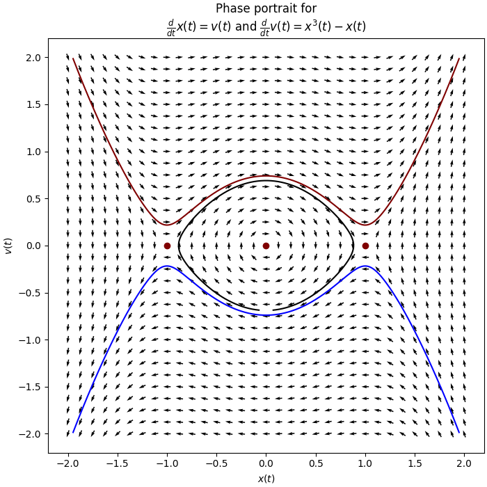

# Nonlinear Dynamics

## Project Description

Project goal was to analyze materials from lecture **Nonlinear Dynamics** at my University. It uses Python libraries for solving differential equations numerically (*SciPy*) and analytically (*SymPy*). All visualizations are created in *MatPlotLib*.

## Images

# Logistic Maps

    
    

    
    

# Phase Plane Portrait

    
    

    
    

# Harmonic Oscillator

    
    
    

    
    

    
    

# Deterministic Chaos

# Reconstructing Attractors

